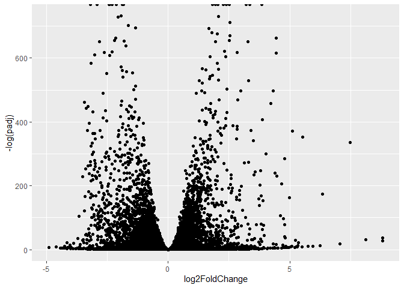
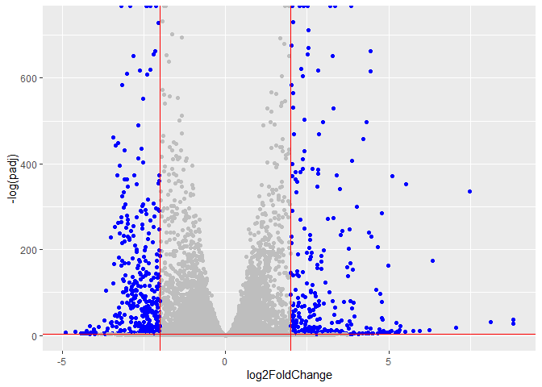

# Class 14: RNASeq mini project
Jennifer Thai (PID: A17893762)

- [Background](#background)
- [Data Import](#data-import)
  - [Remove zero count genes](#remove-zero-count-genes)
- [DESeq analysis](#deseq-analysis)
- [Data Visualization](#data-visualization)
- [Add Annotation](#add-annotation)
- [Pathway Analysis](#pathway-analysis)
  - [KEGG pathways](#kegg-pathways)
  - [GO terms](#go-terms)
  - [Reactome](#reactome)
- [Save Our Results](#save-our-results)

## Background

Here we work through a complete RNASeq analysis project. The input data
comes from a knock-down experiment of a HOX gene

## Data Import

Reading the `counts` and `metadata` CSV files

``` r
counts <- read.csv("GSE37704_featurecounts.csv", row.names = 1)
metadata <- read.csv("GSE37704_metadata.csv")
```

Check on data structure

``` r
head(counts)
```

                    length SRR493366 SRR493367 SRR493368 SRR493369 SRR493370
    ENSG00000186092    918         0         0         0         0         0
    ENSG00000279928    718         0         0         0         0         0
    ENSG00000279457   1982        23        28        29        29        28
    ENSG00000278566    939         0         0         0         0         0
    ENSG00000273547    939         0         0         0         0         0
    ENSG00000187634   3214       124       123       205       207       212
                    SRR493371
    ENSG00000186092         0
    ENSG00000279928         0
    ENSG00000279457        46
    ENSG00000278566         0
    ENSG00000273547         0
    ENSG00000187634       258

``` r
metadata
```

             id     condition
    1 SRR493366 control_sirna
    2 SRR493367 control_sirna
    3 SRR493368 control_sirna
    4 SRR493369      hoxa1_kd
    5 SRR493370      hoxa1_kd
    6 SRR493371      hoxa1_kd

Some book-keeping is required as there looks to be a mismatch between
metadata rows and counts columns

``` r
ncol(counts)
```

    [1] 7

``` r
nrow(metadata)
```

    [1] 6

> Q. Complete the code below to remove the troublesome first column from
> `counts`

Looks like we need to get rid of the first “length” column of our
`counts` object.

``` r
cleancounts <- counts[, -1]
```

``` r
colnames(cleancounts)
```

    [1] "SRR493366" "SRR493367" "SRR493368" "SRR493369" "SRR493370" "SRR493371"

``` r
metadata$id
```

    [1] "SRR493366" "SRR493367" "SRR493368" "SRR493369" "SRR493370" "SRR493371"

``` r
colnames(cleancounts) == metadata$id
```

    [1] TRUE TRUE TRUE TRUE TRUE TRUE

### Remove zero count genes

There are lots of genes with zero counts. We can remove these from
further analysis.

``` r
head(cleancounts)
```

                    SRR493366 SRR493367 SRR493368 SRR493369 SRR493370 SRR493371
    ENSG00000186092         0         0         0         0         0         0
    ENSG00000279928         0         0         0         0         0         0
    ENSG00000279457        23        28        29        29        28        46
    ENSG00000278566         0         0         0         0         0         0
    ENSG00000273547         0         0         0         0         0         0
    ENSG00000187634       124       123       205       207       212       258

> Q. Complete the code below to filter `cleancounts` to exclude genes
> (i.e. rows) where we have 0 read count across all samples
> (i.e. columns).

``` r
to.keep.inds <- rowSums(cleancounts) > 0
nonzero_counts <- cleancounts[to.keep.inds, ]
```

## DESeq analysis

Load the package

``` r
library(DESeq2)
```

    Warning: package 'matrixStats' was built under R version 4.5.2

Setup DESeq object

``` r
dds <- DESeqDataSetFromMatrix(countData = nonzero_counts,
                              colData = metadata,
                              design = ~condition)
```

    Warning in DESeqDataSet(se, design = design, ignoreRank): some variables in
    design formula are characters, converting to factors

Run DESeq

``` r
dds <- DESeq(dds)
```

    estimating size factors

    estimating dispersions

    gene-wise dispersion estimates

    mean-dispersion relationship

    final dispersion estimates

    fitting model and testing

Get results

``` r
res <- results(dds)
head(res)
```

    log2 fold change (MLE): condition hoxa1 kd vs control sirna 
    Wald test p-value: condition hoxa1 kd vs control sirna 
    DataFrame with 6 rows and 6 columns
                     baseMean log2FoldChange     lfcSE       stat      pvalue
                    <numeric>      <numeric> <numeric>  <numeric>   <numeric>
    ENSG00000279457   29.9136      0.1792571 0.3248216   0.551863 5.81042e-01
    ENSG00000187634  183.2296      0.4264571 0.1402658   3.040350 2.36304e-03
    ENSG00000188976 1651.1881     -0.6927205 0.0548465 -12.630158 1.43990e-36
    ENSG00000187961  209.6379      0.7297556 0.1318599   5.534326 3.12428e-08
    ENSG00000187583   47.2551      0.0405765 0.2718928   0.149237 8.81366e-01
    ENSG00000187642   11.9798      0.5428105 0.5215598   1.040744 2.97994e-01
                           padj
                      <numeric>
    ENSG00000279457 6.86555e-01
    ENSG00000187634 5.15718e-03
    ENSG00000188976 1.76549e-35
    ENSG00000187961 1.13413e-07
    ENSG00000187583 9.19031e-01
    ENSG00000187642 4.03379e-01

> Q. Call the summary() function on your results to get a sense of how
> many genes are up or down-regulated at the default 0.1 p-value cutoff.

``` r
summary(res)
```


    out of 15975 with nonzero total read count
    adjusted p-value < 0.1
    LFC > 0 (up)       : 4349, 27%
    LFC < 0 (down)     : 4396, 28%
    outliers [1]       : 0, 0%
    low counts [2]     : 1237, 7.7%
    (mean count < 0)
    [1] see 'cooksCutoff' argument of ?results
    [2] see 'independentFiltering' argument of ?results

## Data Visualization

Volcano plot

``` r
library(ggplot2)
```

    Warning: package 'ggplot2' was built under R version 4.5.2

``` r
ggplot(res) +
  aes(log2FoldChange, -log(padj)) +
  geom_point()
```

    Warning: Removed 1237 rows containing missing values or values outside the scale range
    (`geom_point()`).



> Q. Improve this plot by completing the below code, which adds color
> and axis labels

Add threshold lines for fold-change and p-value and color our subset of
genes that make these threshold cut-offs in the plot

``` r
mycols <- rep("gray", nrow(res))
mycols[ abs(res$log2FoldChange) > 2 ] <- "blue"
mycols[ res$padj > 0.05 ] <- "gray"

ggplot(res) +
  aes(log2FoldChange, -log(padj)) +
  geom_point(col=mycols) +
  geom_vline(xintercept = c(-2,2), col="red") +
  geom_hline(yintercept = -log(0.05), col="red")
```

    Warning: Removed 1237 rows containing missing values or values outside the scale range
    (`geom_point()`).



## Add Annotation

> Q. Use the mapIDs() function multiple times to add SYMBOL, ENTREZID
> and GENENAME annotation to our results by completing the code below.

Add gene symbols and entrez ids

``` r
library(AnnotationDbi)
library(org.Hs.eg.db)
```

``` r
columns(org.Hs.eg.db)
```

     [1] "ACCNUM"       "ALIAS"        "ENSEMBL"      "ENSEMBLPROT"  "ENSEMBLTRANS"
     [6] "ENTREZID"     "ENZYME"       "EVIDENCE"     "EVIDENCEALL"  "GENENAME"    
    [11] "GENETYPE"     "GO"           "GOALL"        "IPI"          "MAP"         
    [16] "OMIM"         "ONTOLOGY"     "ONTOLOGYALL"  "PATH"         "PFAM"        
    [21] "PMID"         "PROSITE"      "REFSEQ"       "SYMBOL"       "UCSCKG"      
    [26] "UNIPROT"     

``` r
res$symbol <- mapIds(x=org.Hs.eg.db,
                    keys = row.names(res),
                    keytype = "ENSEMBL",
                    column = "SYMBOL")
```

    'select()' returned 1:many mapping between keys and columns

``` r
res$entrez <- mapIds(x=org.Hs.eg.db,
                    keys = row.names(res),
                    keytype = "ENSEMBL",
                    column = "ENTREZID")
```

    'select()' returned 1:many mapping between keys and columns

## Pathway Analysis

### KEGG pathways

Run gage analysis with KEGG

``` r
library(gage)
library(gageData)
library(pathview)
```

We need a named vector of fold-change values as input for gage

``` r
foldchanges = res$log2FoldChange
names(foldchanges) = res$entrez
head(foldchanges)
```

           <NA>      148398       26155      339451       84069       84808 
     0.17925708  0.42645712 -0.69272046  0.72975561  0.04057653  0.54281049 

``` r
data(kegg.sets.hs)

keggres = gage(foldchanges, gsets=kegg.sets.hs)
```

``` r
head(keggres$less, 2)
```

                                p.geomean stat.mean        p.val       q.val
    hsa04110 Cell cycle      8.995727e-06 -4.378644 8.995727e-06 0.001889103
    hsa03030 DNA replication 9.424076e-05 -3.951803 9.424076e-05 0.009841047
                             set.size         exp1
    hsa04110 Cell cycle           121 8.995727e-06
    hsa03030 DNA replication       36 9.424076e-05

``` r
pathview(pathway.id = "hsa04110", gene.data = foldchanges)
```

    'select()' returned 1:1 mapping between keys and columns

    Info: Working in directory C:/Users/thaij/OneDrive/Desktop/BIMM143/bimm143_github/class14

    Info: Writing image file hsa04110.pathview.png


``` r
pathview(pathway.id = "hsa03030", gene.data = foldchanges)
```

    'select()' returned 1:1 mapping between keys and columns

    Info: Working in directory C:/Users/thaij/OneDrive/Desktop/BIMM143/bimm143_github/class14

    Info: Writing image file hsa03030.pathview.png


### GO terms

Same analysis but using GO genesets rather than KEGG

``` r
data(go.sets.hs)
data(go.subs.hs)

# Focus on Biological Process subset of GO
gobpsets = go.sets.hs[go.subs.hs$BP]

gobpres = gage(foldchanges, gsets=gobpsets)
```

``` r
head(gobpres$less, 4)
```

                                                p.geomean stat.mean        p.val
    GO:0048285 organelle fission             1.536227e-15 -8.063910 1.536227e-15
    GO:0000280 nuclear division              4.286961e-15 -7.939217 4.286961e-15
    GO:0007067 mitosis                       4.286961e-15 -7.939217 4.286961e-15
    GO:0000087 M phase of mitotic cell cycle 1.169934e-14 -7.797496 1.169934e-14
                                                    q.val set.size         exp1
    GO:0048285 organelle fission             5.841698e-12      376 1.536227e-15
    GO:0000280 nuclear division              5.841698e-12      352 4.286961e-15
    GO:0007067 mitosis                       5.841698e-12      352 4.286961e-15
    GO:0000087 M phase of mitotic cell cycle 1.195672e-11      362 1.169934e-14

### Reactome

Lots of folks like the reactome web interface. You can also run this as
an R function but lets look at the website first \<
https://reactome.org/ \>

The website wants a text file with one gene symbol per line of the genes
you want to map to pathways.

``` r
sig_genes <- res[res$padj <= 0.05 & !is.na(res$padj), ]$symbol
head(sig_genes) #res$symbol
```

    ENSG00000187634 ENSG00000188976 ENSG00000187961 ENSG00000188290 ENSG00000187608 
           "SAMD11"         "NOC2L"        "KLHL17"          "HES4"         "ISG15" 
    ENSG00000188157 
             "AGRN" 

and write out to a file:

``` r
write.table(sig_genes, file="significant_genes.txt", 
            row.names=FALSE, col.names=FALSE, quote=FALSE)
```

## Save Our Results

``` r
write.csv(res, file = "myresults.csv")
```
