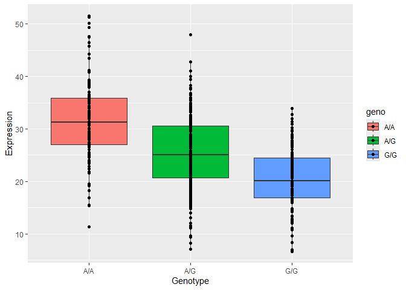

# Class 17 Q13-14
Jennifer Thai (PID: A17893762)

> Q13: Read this file into R and determine the sample size for each
> genotype and their corresponding median expression levels for each of
> these genotypes. Hint: The read.table(), summary() and boxplot()
> functions will likely be useful here. There is an example R script
> online to be used ONLY if you are struggling in vein. Note that you
> can find the medium value from saving the output of the boxplot()
> function to an R object and examining this object. There is also the
> medium() and summary() function that you can use to check your
> understanding.

``` r
file_path <- "sample geno exp.txt"

my_table <- read.table(
      file = file_path,
      header = TRUE,  
      sep = " ",    
      skip = 0       
    )
```

``` r
table(my_table$geno)
```


    A/A A/G G/G 
    108 233 121 

``` r
tapply(my_table$exp, my_table$geno, median)
```

         A/A      A/G      G/G 
    31.24847 25.06486 20.07363 

> Q14: Generate a boxplot with a box per genotype, what could you infer
> from the relative expression value between A/A and G/G displayed in
> this plot? Does the SNP effect the expression of ORMDL3? Hint: An
> example boxplot is provided overleaf – yours does not need to be as
> polished as this one.

``` r
library(ggplot2)
```

    Warning: package 'ggplot2' was built under R version 4.5.2

``` r
ggplot(my_table, aes(x = geno, y = exp, fill = geno)) +
  geom_boxplot() +
  labs(x = "Genotype", y = "Expression") +
  geom_point()
```



G/G has a lower expression value compared to A/A and A/G at this
position/locus, and the SNP does affect the expression of ORMDL3 in that
a copy of the G allele will reduce the expression of this gene. This
explains why G/G has the lowest expression value and why A/A has the
highest expression.
